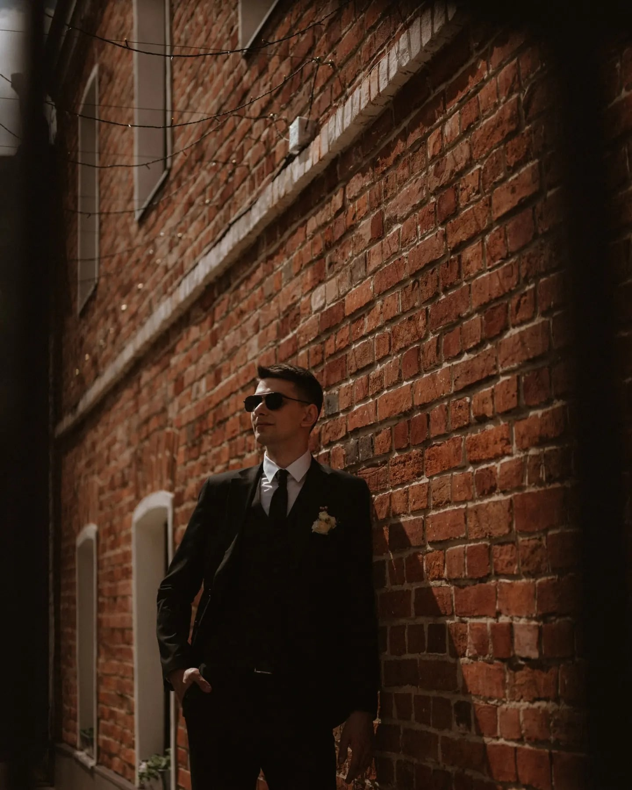

# Немного о себе

Всем привет! Меня зовут Сергей, мне 25 лет и я работаю в IT-компании **ООО "Большая тройка"** и учусь в **Нетологии**.

Курсы Нетологии помогают мне повысисть свою квалификацию как сотрудника.

В Большой тройке я работаю системным аналитиком и уже применяю полученные знания на практике, это позволяет лучше осваиваться в выбранном направлении, так как я параллельно веду разработку в реальном проекте.

Мое фото:
